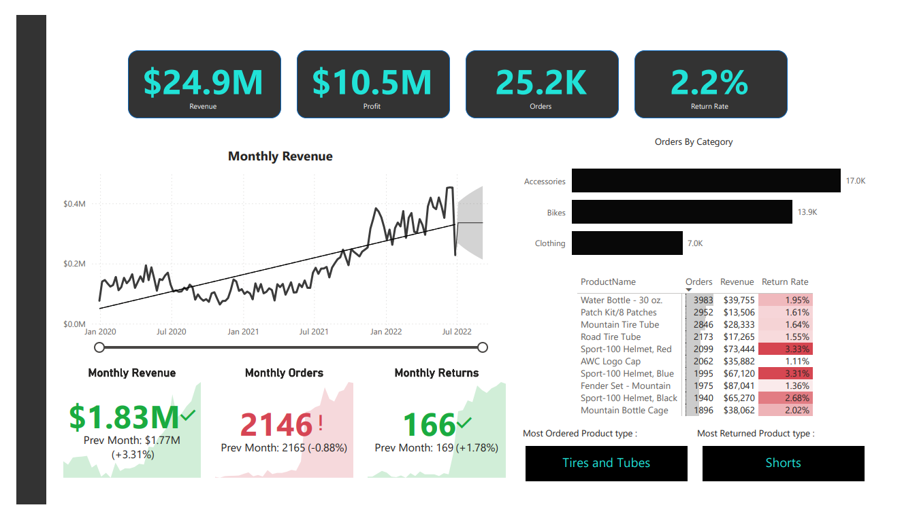
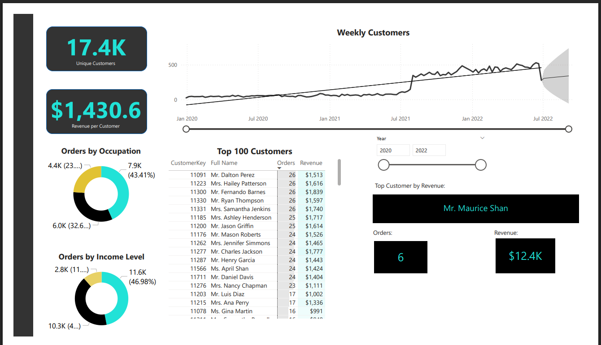
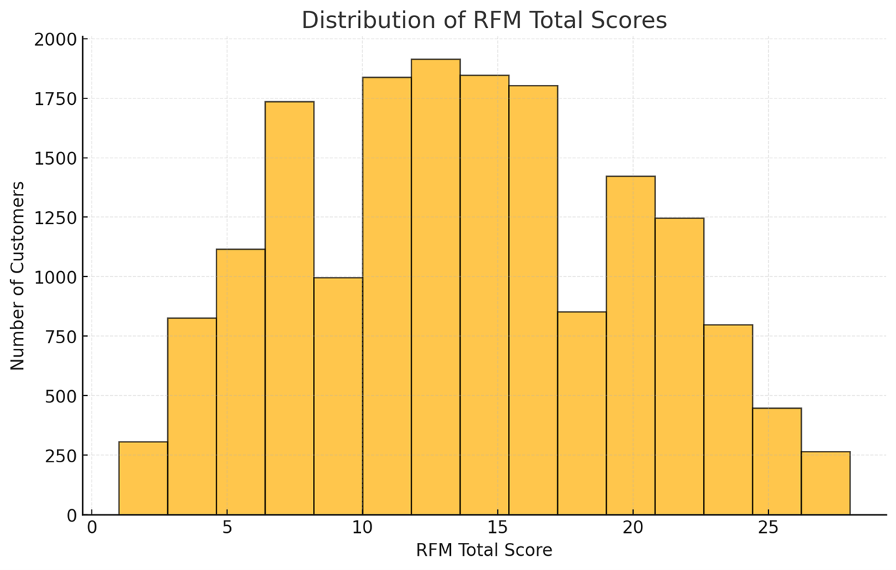
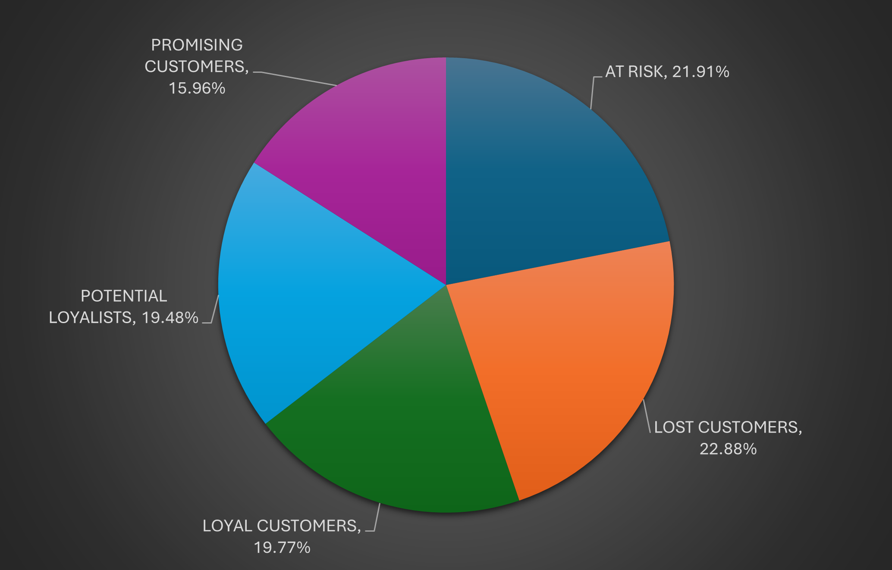

# Portfolio

Welcome to my portfolio website repository! I'm **Leela Santosh Chowdary Simhadri**, As a **data and marketing analyst** with a passion for transforming raw data into actionable media strategies. With hands-on experience in forecasting, programmatic insights, and KPI-driven storytelling, I specialize in performance media analytics using Python, SQL, and BI tools. This portfolio showcases my work across customer segmentation, digital campaign optimization, and test-and-learn experimentation.

## About Me

I am deeply passionate about transforming raw data into actionable insights that drive effective marketing decisions. My expertise lies in utilizing tools such as **SQL**, **Python**, **R**, and data visualization platforms like **Tableau** and **Power BI**. I enjoy diving deep into datasets, unraveling trends, and crafting strategies that enhance marketing performance and improve return on investment (ROI).

## Techincal Skills 
**•	Programming & Tools: Python, SQL, R, Excel, SPSS, SAS, Alteryx**

**•	Data Visualization: Tableau, Power BI, Google Analytics**

**•	Analytics Techniques: Predictive Modelling, Statistical Analysis, Forecasting (ARIMA, VAR, A/B, Testing Data Wrangling, KPI Reporting, Trend 
                        Analysis**

### Education
• Masters in Marketing Analytics & Insights
  
• Wright State University • Dayton, OH • Aug 2023 • 3.9 GPA

## My Work experience

### **1. Data Science Project at MedTourEasy Medical**

During my tenure as a **Data Science Trainee** at MedTourEasy Medical, I spearheaded an analytical project that involved processing and analyzing over 500,000 fitness data records. This project aimed to uncover valuable trends in user activity, engagement, and performance metrics. I utilized **Python** and **R** to build machine learning models, achieving an impressive 85% accuracy in predicting user retention. Additionally, I developed personalized workout recommendations, enhancing the user experience. To streamline data reporting and decision-making, I designed interactive **Tableau** dashboards that reduced reporting time by 40% and facilitated quicker insights for stakeholders.

## My Projects

### Project: Customer-Centric Sales Optimization and Marketing Strategies for Athletic Retail (Oct 2024 - Dec 2024)

This is my Capstone Project, I led a strategic initiative to enhance sales and marketing performance within the athletic retail sector. The core objective was to transform raw customer data into actionable insights that could drive targeted marketing strategies and boost sales revenue. Leveraging Python, I employed advanced clustering techniques to segment customers into six distinct groups based on their income, education level, and purchasing behavior. This segmentation allowed us to tailor our marketing strategies effectively, addressing the unique needs of each customer cohort.

To further optimize retention strategies, I implemented a comprehensive RFM (Recency, Frequency, Monetary) analysis, which proved instrumental in identifying and nurturing loyal customers. This strategic move resulted in a remarkable 50% increase in revenue contribution from our most loyal customer base. Additionally, I developed dynamic and interactive dashboards using Power BI, providing the sales and marketing teams with real-time insights into customer trends. The visualization tools not only improved decision-making but also empowered teams to launch highly effective targeted campaigns, leading to a 25% boost in customer engagement. The project underscored my ability to blend analytical expertise with business acumen, driving tangible business outcomes through data-driven strategies. Below are the visualizations of Sales in Dashboard and RFM Analysis.

<h3>Visualizations from RFM and Sales Dashboard</h3>

Below are key visuals supporting my RFM-based customer segmentation and sales performance dashboard analysis.

### Project: Predictive Revenue Modeling for University Football Team (May 2024 - Jun 2024)

As a forecasting analyst, I designed a predictive model to estimate seasonal revenue generated from a university football team’s media campaigns and sponsorship efforts. Leveraging Python’s forecasting libraries and integrating SQL pipelines, I built a model that provided a 95% confidence interval on annual revenue projections. These forecasts played a pivotal role in guiding strategic sponsorship decisions and budget allocations.

The project culminated in a cross-functional presentation supported by dynamic Tableau dashboards that visualized weekly revenue trends and ROI projections. Insights from the model helped optimize campaign pacing, media placement timing, and stakeholder alignment — resulting in a 20% increase in sponsorship acquisitions and a 15% rise in ticket sales. This project demonstrated my ability to translate forecasting insights into measurable business outcomes within a performance media context.

### Project: Audience Behavior and KPI Analysis for Digital Display & Paid Campaigns  (Jan 2024 - April 2024)

In this project, I analyzed customer data for a mid-sized restaurant brand to identify behavioral and demographic segments that could be targeted more effectively via programmatic campaigns. Using Tableau and Excel, I built visualizations that broke down satisfaction trends, engagement metrics, and repeat visit behavior by segment. These insights helped create tailored content and media strategies that increased campaign resonance across platforms.

I also evaluated survey-based feedback to validate targeting assumptions and adjust messaging strategies. The result was a 15% increase in campaign targeting effectiveness and a 10% boost in overall customer satisfaction. Through structured KPI development and behavioral data analysis, I was able to enhance digital media decision-making and optimize the impact of performance marketing tactics.

### Project: Test-and-Learn Strategy for Local Business Promotions  (Oct 2023 - Dec 2023)

For this project, I collaborated with a local business to design a performance-focused marketing and growth strategy that incorporated digital promotion channels, influencer marketing, and RTB-based experimentation. I performed SWOT and competitive analysis to identify market positioning gaps and used a test-and-learn model to measure the effectiveness of various campaign formats — including time-based discounts, walk-in promotions, and social engagement initiatives.

I developed a KPI framework that monitored average customer spend, repeat visits, and conversion rate by channel. Dashboards and insights guided iterative campaign changes, resulting in increased foot traffic and improved ROI per campaign. This hands-on experience with real-time campaign optimization showcased my ability to support media planning, data-driven storytelling, and client-side execution — all essential for success in Horizon Media’s Performance Media group.

## Certifications

- IBM Data Science (Coursera, 2024)
- Power BI (Udemy, 2023)
- Google Adwords (Google, 2023)

## Contact

- Email: santoshchowdarysimhadri.23f@gmail.com
- LinkedIn: [Santosh Simhadri](http://www.linkedin.com/in/santoshsimhadri)
- GitHub: [Your GitHub Profile](your-github-url)

Thank you for taking the time to visit my portfolio. I look forward to connecting with you and discussing how my skills and experiences align with your needs.

